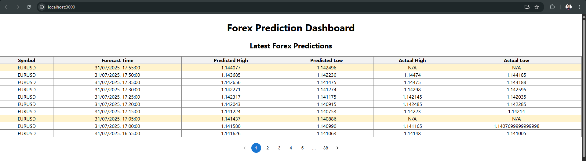
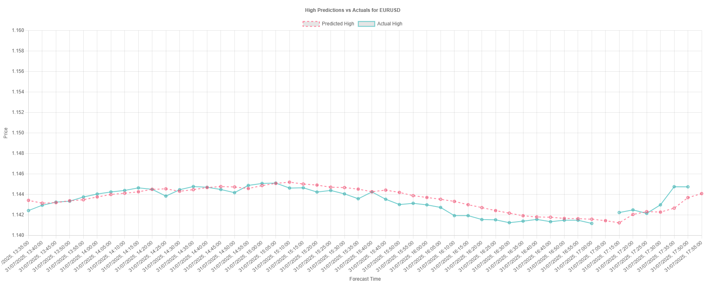
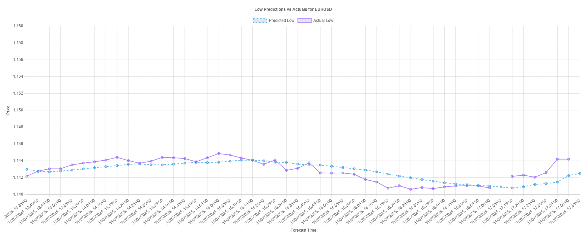

Forex Predictions Webapp
This project provides a web application for predicting forex market trends using machine learning models, displaying predictions and actual market data in interactive charts. The backend is built with Django, and the frontend is created using React.
Project Structure
The project is organized as follows:


## Output Charts
Here is a sample chart showing the predicted vs actual forex prices:
#### Prediction Table

#### Prediction Chart - High

#### Prediction Chart - Low



```
├── forex_predictions_webapp                # Main Django application
│   ├── forex_app                           # Django app with views, models, and APIs
│   ├── forex_project                       # Django project configuration (settings, URLs, WSGI, etc.)
│   ├── frontend                            # React frontend for UI and charts
│   │   ├── node_modules                    # Frontend dependencies (auto-installed)
│   │   ├── public                          # Public static files (HTML, images, etc.)
│   │   ├── src                             # React components, pages, and hooks
│   │   ├── .gitignore                      # Git ignore rules for the frontend
│   │   ├── package-lock.json               # Lock file for exact frontend dependencies
│   │   └── package.json                    # Frontend dependencies and scripts
│   ├── manage.py                           # Django project management script
│
├── model_training_codes                    # ML model training and data processing scripts
│   ├── __pycache__                         # Python cache files (auto-generated)
│   ├── preprocessed_csv                    # Pre-processed data files (CSV)
│   ├── trained_models                      # Saved trained LSTM models
│   ├── data_preprocessing.py               # Data cleaning and preprocessing script
│   ├── fetching_to_training.py             # Fetching and training pipeline script
│   ├── get_data.py                         # Fetching data from MetaTrader 5 (MT5)
│   ├── test_models.py                      # Scripts to test trained models
│   ├── training_LSTM_models_hlcc_4.py      # Advanced LSTM training configuration
│   └── training_LSTM_models.py             # Standard LSTM training script
└── requirements.txt                        # Python backend dependencies
```


Installation
### Backend (Django)

1. **Create a virtual environment**:
   ```bash
   python -m venv venv
   ```
2. **Activate the virtual environment**:
   - On Windows:
     ```bash
     venv\Scripts\activate
     ```
   - On macOS/Linux:
     ```bash
     source venv/bin/activate
     ```
3. **Install dependencies**:
   ```bash
   pip install -r requirements.txt
   ```
4. **Apply migrations**:
   ```bash
   python manage.py migrate
   ```
5. **Run the Django server**:
   ```bash
   python manage.py runserver
   ```

### Frontend (React)

1. **Navigate to the frontend folder**:
   ```bash
   cd frontend
   ```
2. **Install dependencies**:
   ```bash
   npm install
   ```
3. **Start the React development server**:
   ```bash
   npm start
   ```
   The frontend will now be running on [http://localhost:3000](http://localhost:3000).

Usage

1. **API Endpoints**:
   - The Django backend exposes several endpoints to fetch predictions, including:
     - `GET /api/latest/`: Fetch the latest forex predictions.
     - `GET /api/predictions/{symbol}/`: Fetch predictions for a specific currency pair (e.g., EURUSD).


2. **Frontend**:
   - The frontend will display the predictions in an interactive chart.
   - It fetches data from the Django API at regular intervals (every 2 minutes) and updates the chart.


3. **Model Training**:
   - The scripts in the `model_training_codes` folder handle the training of LSTM models using historical forex data. It includes:
     - `training_LSTM_models.py`: A script for training the LSTM models.
     - `data_preprocessing.py`: Preprocessing of raw data before training.

Running the Service

To run the entire service:
1. **Start the Django backend** (`python manage.py runserver`).
2. **Start the React frontend** (`npm start`).

Requirements

- Python 3.x
- Django
- Node.js and npm (for the frontend)
- MetaTrader 5 (for fetching forex data)
- Machine learning dependencies for model training (e.g., TensorFlow, scikit-learn)